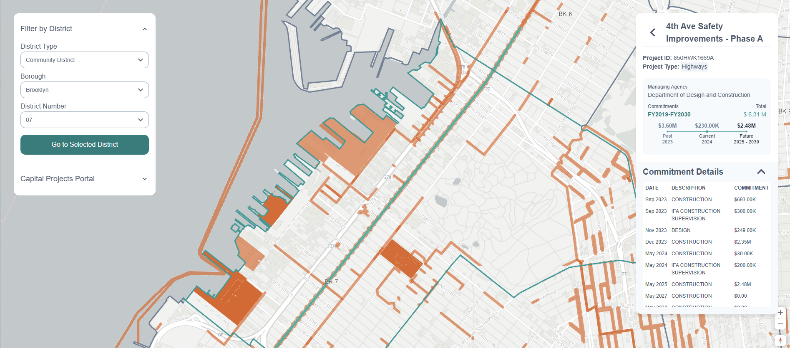

# Capital Planning Explorer/Capital Projects Portal: Product Roadmap

Our roadmap to illustrate design goals for the Capital Planning Portal (also previously known as the Capital Planning Explorer).

> [!NOTE]
> Currently, our product is being referred to as the Capital Projects Portal (CPP).

## Overview

The [Capital Projects Portal](https://capitalprojects.nycplanningdigital.com/) is a digital product geared to provide information about Capital Projects to the general public.

> A “capital project” involves the construction, reconstruction, acquisition, or installation of a physical public improvement with a value of $50,000 or more and a “useful life” of at least five years (three years for Information Technology projects). This encompasses spending on physical public works projects, such as roads, sewers, and bridges, as well as investments in core information and technology infrastructure, and critical equipment, like fire trucks

With DCP's vision to provide an accessible and consistent solution by visualizing data from the [Capital Projects Database](https://www.nyc.gov/site/planning/data-maps/open-data/dwn-capital-planning-database.page) by organizing key information from a wide range of projects managed by various agencies.

## Current Phase: Usability Testing through Friends and Family Launch

### Live Beta Version

The CPP's current capabilities consists of:

- locate projects in a map interface represented in polygons and points
- refining a search by using filtering by an attribute (i.e. Community District, City Council District)
- present key information on a particular project to inform the audience
  - project name, id, and type
  - managing agency
  - past, current, and future commitments
  - commitment details which consists of the breakdown of individual commitments of the sponsor and their allocated amount
  
> [!IMPORTANT]
> The key difference between a point and polygon is the area a project can impact. Ideally, majority of projects would be polygons as they tend to span a larger area compared to a point.

*An example of a selected project filtered by Community District.*

### Research Goals

Our primary goal is to understand whether the usability of CPP is intuitive and easy to use while having the ability to customize to a user's preference to refine their search amongst the diverse range of mapped capital projects.

Therefore, for this phase we will seek to accomplish this goal through the following methods in a mixed method approach:

- gathering quantitative data through a System Usability Scale (SUS) evaluation to gauge the usability of the current CPP's system
- ...
