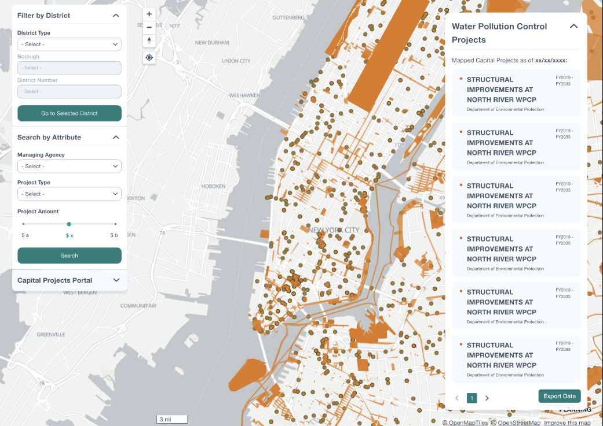

# Capital Planning Explorer/Capital Projects Portal: Product Roadmap

Our roadmap to illustrate design goals for the Capital Planning Portal (also previously known as the Capital Planning Explorer).

> [!NOTE]
> Currently, our product is being referred to as the Capital Projects Portal (CPP).

## Overview

The [Capital Projects Portal](https://capitalprojects.nycplanningdigital.com/) is a digital product geared to provide information about Capital Projects to the general public.

> A “capital project” involves the construction, reconstruction, acquisition, or installation of a physical public improvement with a value of $50,000 or more and a “useful life” of at least five years (three years for Information Technology projects). This encompasses spending on physical public works projects, such as roads, sewers, and bridges, as well as investments in core information and technology infrastructure, and critical equipment, like fire trucks

With DCP's vision to provide an accessible and consistent solution by visualizing data from the [Capital Projects Database](https://www.nyc.gov/site/planning/data-maps/open-data/dwn-capital-planning-database.page) by organizing key information from a wide range of projects managed by various agencies.

## Current Phase (Early Q1 2025): Usability Testing through Friends and Family Launch

### Live Beta Version

The CPP's current capabilities consists of:

- locate projects in a map interface represented in polygons and points
- refining a search by using filtering by an attribute (i.e. Community District, City Council District)
- present key information on a particular project to inform the audience
  - project name, id, and type
  - managing agency
  - past, current, and future commitments
  - commitment details which consists of the breakdown of individual commitments of the sponsor and their allocated amount
  
> [!IMPORTANT]
> The key difference between a point and polygon is the area a project can impact. Ideally, majority of projects would be polygons as they tend to span a larger area compared to a point.

*An example of a selected project filtered by Community District.*

### Research Goals and Methods

Our primary goal is to understand whether the usability of CPP is intuitive and easy to use while having the ability to customize to a user's preference to refine their search amongst the diverse range of mapped capital projects.

Therefore, for this phase we will seek to accomplish this goal through the following methods in a mixed method approach:

- obtaining quantitative data through a System Usability Scale (SUS) evaluation to gauge the usability of the current CPP's system

  > SUS provides a quick and accurate metric to gauge a system's usability. Average SUS scores tend to range from 60-70 points out of 100, with 80+ being an good score indicating excellent usability. **We aim to gather a minimum of 14 responses to get an 90+% confidence level to have reliable results.**

- gathering qualitative data through usability testing interviews to pinpoint issues and understand observations from direct feedback

  > **We aim to conduct 5 interviews as this amount often reflects 80% of usability issues.** We will be concentrating on time on task, task success and general commentary. Refer to the [usability script](https://github.com/NYCPlanning/design/blob/c3a3310dee2197da668bb706d862ccc5da907359/CPP%20(CPE)/usability-interview-script.md) for more details.

**This research phase will be conducted during Q1 2025.**

## Future Phase: Additional Filter Features

The current build of CPP provides a foundation for general searching. To enhance this experience, additional features that have been requested are filtering by project type, total commitments amount, and managing agency to help users refine their search. [Desktop wireframes are avaliable in Figma.](https://www.figma.com/design/LYHHoPop9l0jpEivk5CFzJ/Capital-Projects-Portal?node-id=2728-6859&t=AdKOMXezsSae0dNG-1)

*Hi-Fi desktop wireframe of all three additional filters.*

Application Engineering will be working on these features in Q1. The following user stories were created to guide their implementation:

- [User Story: Search by Attribute: Managing Agency](https://github.com/NYCPlanning/ae-cp-map/issues/126)
- [User Story: Search by Attribute: Project Type](https://github.com/NYCPlanning/ae-cp-map/issues/127)
- [User Story: Search by Attribute: Project Amount](https://github.com/NYCPlanning/ae-cp-map/issues/128)

**This phase will occur later in Q1 2025 and has the potential to change once our analysis is complete from our research phase.**
